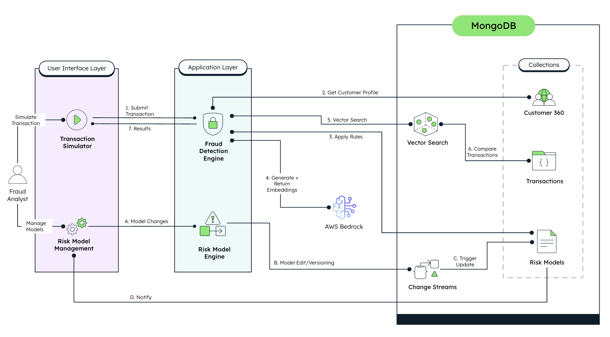

# ThreatSight 360 - Financial Fraud Detection System


In today's rapidly evolving financial landscape, detecting fraudulent transactions quickly and accurately is crucial. Financial institutions of all sizes struggle with balancing customer experience with robust fraud protection. Solutions such as real-time risk assessment, multi-factor analysis, and AI-powered pattern recognition can help your organization overcome these challenges and take your fraud detection capabilities to the next level. Additionally, with features like vector-based fraud pattern recognition, dynamic risk model management, and interactive transaction simulation, our system ensures your fraud prevention operations run effectively, even against evolving threats.

By the end of this guide, you'll have a comprehensive fraud detection system up and running capable of all the solutions mentioned above.

We will walk you through the process of configuring and using [MongoDB Atlas](https://www.mongodb.com/atlas) as your backend with [AWS Bedrock](https://aws.amazon.com/bedrock/) for AI-powered risk assessment in your [Next.js](https://nextjs.org/) and [FastAPI](https://fastapi.tiangolo.com/) application.

The architecture we're about to set up is depicted in the diagram below:



If you want to learn more about Financial Fraud Detection and AI-powered Risk Assessment, visit the following pages:

- [MongoDB for Financial Services](https://www.mongodb.com/industries/financial-services)
- [AWS Bedrock Foundation Models](https://aws.amazon.com/bedrock/foundation-models/)
- [Vector Search for Fraud Detection](https://www.mongodb.com/use-cases/fraud-detection)
- [Building Real-time Fraud Detection Systems](https://www.mongodb.com/developer/products/atlas/vector-search-fraud-detection/)

Let's get started!

## Prerequisites

Before you begin working with this project, ensure that you have the following prerequisites set up in your development environment:

- **Python 3.10+**: The backend of this project is built with Python. You can download it from the [official website](https://www.python.org/downloads/).

- **Node.js 18+**: The frontend requires Node.js 18 or higher, which includes npm for package management. You can download it from the [official Node.js website](https://nodejs.org/).

- **Poetry**: The backend uses Poetry for dependency management. Install it by following the instructions on the [Poetry website](https://python-poetry.org/docs/#installation).

- **MongoDB Atlas Account**: This project uses MongoDB Atlas for data storage and vector search capabilities. If you don't have an account, you can sign up for free at [MongoDB Atlas](https://www.mongodb.com/cloud/atlas/register). Once you have an account, follow these steps to set up a minimum free tier cluster:

  - Log in to your MongoDB Atlas account.
  - Create a new project or use an existing one, and then click "create a new database".
  - Choose the free tier option (M0).
  - Configure the cluster settings according to your preferences and then click "finish and close" on the bottom right.
  - Finally, add your IP to the network access list so you can access your cluster remotely.

- **AWS Account with Bedrock Access**: You'll need an AWS account with access to the Bedrock service for AI foundation models. Visit the [AWS Console](https://aws.amazon.com/console/) to set up an account and request access to Bedrock.

- **Docker (Optional)**: For containerized deployment, Docker is required. Install it from the [Docker website](https://www.docker.com/get-started).

## Initial Configuration

### Obtain your MongoDB Connection String

Once the MongoDB Atlas Cluster is set up, locate your newly created cluster, click the "Connect" button and select the "Connect your application" section. Copy the provided connection string. It should resemble something like this:

```
mongodb+srv://<username>:<password>@cluster-name.xxxxx.mongodb.net/
```

> [!Note]
> You will need the connection string to set up your environment variables later (`MONGODB_URI`).

### Set up AWS Bedrock Access

1. Log in to your AWS Management Console.

2. Navigate to the Bedrock service or search for "Bedrock" in the AWS search bar.

3. Follow the prompts to request access to the Bedrock service if you haven't already.

4. Once access is granted, create an IAM user with programmatic access and appropriate permissions for Bedrock.

5. Save the AWS Access Key ID and Secret Access Key for later use in your environment variables.

> [!Important]
> Keep your AWS credentials secure and never commit them to version control.

### Cloning the Github Repository

Now it's time to clone the ThreatSight 360 source code from GitHub to your local machine:

1. Open your terminal or command prompt.

2. Navigate to your preferred directory where you want to store the project using the `cd` command. For example:

   ```bash
   cd /path/to/your/desired/directory
   ```

3. Once you're in the desired directory, use the `git clone` command to clone the repository:

   ```bash
   git clone https://github.com/yourusername/threatsight360.git
   ```

4. After running the `git clone` command, a new directory with the repository's name will be created in your chosen directory. To navigate into the cloned repository, use the `cd` command:

   ```bash
   cd threatsight360
   ```

## MongoDB Atlas Configuration

### Set up Vector Search

ThreatSight 360 leverages MongoDB Atlas Vector Search for advanced fraud pattern recognition. Follow these steps to enable it:

1. Navigate to your MongoDB Atlas dashboard and select your cluster.

2. Click on the "Search" tab located in the top navigation menu.

3. Click "Create Search Index".

4. Choose the JSON editor and click "Next".

5. Name your index "transaction_vector_index".

6. Select your database and the appropriate collection (typically "transactions").

7. For the index definition, paste the following JSON:

   ```json
   {
     "mappings": {
       "dynamic": true,
       "fields": {
         "vector_embedding": {
           "type": "knnVector",
           "dimensions": 1536,
           "similarity": "cosine"
         }
       }
     }
   }
   ```

8. Click "Next" and confirm by clicking "Create Search Index".

> [!Note]
> The index name ("transaction_vector_index") must be the same for the application to work properly.

### Set up Change Streams

For real-time updates in your application, you'll need to enable change streams in MongoDB Atlas:

1. Navigate to your MongoDB Atlas dashboard and select your cluster.

2. Go to "Database Access" in the left sidebar.

3. Ensure that your database user has the "readWrite" and "dbAdmin" roles for the database you'll be using.

4. For production environments, consider creating a dedicated user with specific privileges for change streams.

> [!Important]
> Change streams require a replica set, which is automatically provided by MongoDB Atlas, even in the free tier.

## Backend Configuration

### Set up Environment Variables

Navigate to the `backend` directory of your project:

```bash
cd backend
```

Create a `.env` file with the following configuration settings:

```
# MongoDB Connection
MONGODB_URI=mongodb+srv://<username>:<password>@cluster-name.xxxxx.mongodb.net/
DB_NAME=threatsight360

# AWS Bedrock Credentials
AWS_ACCESS_KEY_ID=your_aws_access_key_here
AWS_SECRET_ACCESS_KEY=your_aws_secret_key_here
AWS_REGION=us-east-1

# Server Configuration
HOST=0.0.0.0
PORT=8000

# Frontend URL for CORS
FRONTEND_URL=http://localhost:3000
```

Replace the placeholder values with your actual MongoDB URI, AWS credentials, and other settings.

> [!Note]
> Never commit your `.env` file to version control. Make sure it's included in your `.gitignore` file.

### Install Dependencies

While in the `backend` directory, install the required dependencies using Poetry:

```bash
pip install poetry
poetry install
```

This will create a virtual environment and install all the dependencies specified in the `pyproject.toml` file.

### Data Seeding

To populate your database with initial data for testing, run the seeding script:

```bash
poetry run python scripts/seed_data.py
```

This script will create:

- Customer profiles with varied transaction histories
- Sample fraud patterns for testing
- Risk models with different configurations

### Start the Backend Server

Start the FastAPI backend server with the following command:

```bash
poetry run uvicorn main:app --host 0.0.0.0 --port 8000 --reload
```

Your backend API should now be running at [http://localhost:8000](http://localhost:8000).

## Frontend Configuration

### Set up Environment Variables

Navigate to the `frontend` directory of your project:

```bash
cd ../frontend
```

Create a `.env.local` file with the following content:

```
NEXT_PUBLIC_API_URL=http://localhost:8000
```

> [!Note]
> The `.env.local` file will be ignored by Git automatically.

### Install Dependencies

Install the frontend dependencies using npm:

```bash
npm install
```

### Start the Frontend Development Server

Launch the Next.js development server:

```bash
npm run dev
```

Your frontend application should now be running at [http://localhost:3000](http://localhost:3000).

## Using the Application

### Transaction Simulator

The Transaction Simulator allows you to test and visualize how the fraud detection system responds to different scenarios:

1. Navigate to [http://localhost:3000/transaction-simulator](http://localhost:3000/transaction-simulator).

2. Select a customer from the dropdown menu.

3. Choose a predefined fraud scenario or configure your own:

   - Normal Transaction
   - Unusual Amount
   - Unusual Location
   - New Device
   - Multiple Red Flags

4. Customize transaction details if needed:

   - Transaction type (purchase, withdrawal, transfer, deposit)
   - Payment method
   - Amount
   - Merchant category
   - Location information
   - Device information

5. Click "Evaluate Transaction" to analyze the risk profile.

6. Review the comprehensive risk assessment, including:
   - Traditional risk assessment based on rules and patterns
   - Advanced vector search for similar suspicious transactions
   - Multi-factor risk scoring with detailed breakdown
   - Context-aware filtering that prioritizes relevant transactions

> [!Note]
> The simulator is a powerful tool for understanding how the system works and for demonstrating the capabilities to stakeholders.

### Risk Model Management

The Risk Model Management interface allows administrators to configure and deploy different risk assessment models:

1. Navigate to [http://localhost:3000/risk-models](http://localhost:3000/risk-models).

2. View and select from available risk models in the system.

3. Key capabilities include:

   - **Dynamic Risk Factor Management**: Add or modify risk factors without system changes
   - **Real-Time Updates**: See changes instantly using MongoDB Change Streams
   - **Version Control**: Create and manage multiple versions of risk models
   - **Model Activation**: Easily switch between different models
   - **Performance Metrics**: Track effectiveness with false positive/negative rates
   - **Custom Thresholds**: Configure flag and block thresholds for each model

4. To create a new risk model:
   - Click "Create New Model"
   - Configure basic information (name, description)
   - Add risk factors with appropriate weights and thresholds
   - Set overall model thresholds
   - Save and optionally activate the model

> [!Important]
> All changes are reflected in real-time across all connected sessions thanks to MongoDB Change Streams.

## Docker Deployment

For containerized deployment in production environments, you can use Docker Compose:

1. Ensure Docker and Docker Compose are installed on your system.

2. From the root directory of the project, run:

   ```bash
   docker-compose up -d
   ```

3. This will build and run both frontend and backend containers with proper networking.

4. Access the application at [http://localhost:3000](http://localhost:3000).

> [!Note]
> The Docker configuration uses production settings by default. Check the `docker-compose.yml` file for details.

## Demo Scenarios

The Transaction Simulator includes pre-configured scenarios for testing:

1. **Normal Transaction**: A transaction matching the customer's typical behavior pattern

2. **Unusual Amount**: A transaction with an amount significantly above the customer's average

3. **Unusual Location**: A transaction originating from a location outside the customer's normal geographic patterns

4. **New Device**: A transaction from a device not previously associated with the customer

5. **Multiple Red Flags**: A high-risk transaction combining multiple suspicious indicators

Running through these scenarios will give you a good understanding of how the system evaluates different risk factors.

## Troubleshooting

Here are some common issues and their solutions:

- **Database Connection Issues**:

  - Verify your MongoDB connection string and network access settings
  - Ensure your IP address is whitelisted in MongoDB Atlas

- **AWS Bedrock Errors**:

  - Ensure your AWS credentials are valid and have appropriate permissions
  - Check that you have access to the Bedrock service in your AWS account

- **Frontend API Errors**:

  - Check that the backend server is running and CORS is properly configured
  - Verify the API URL in your frontend environment variables

- **Docker Deployment Issues**:
  - Verify port mappings and network settings in docker-compose.yml
  - Check Docker logs with `docker-compose logs`

## Additional Resources

Check additional and accompanying resources below:

- [MongoDB for Financial Services](https://www.mongodb.com/industries/financial-services)
- [AWS Bedrock AI Foundation Models](https://aws.amazon.com/bedrock/foundation-models/)
- [FastAPI Documentation](https://fastapi.tiangolo.com/)
- [Next.js Documentation](https://nextjs.org/docs)
- [MongoDB LeafyGreen UI](https://www.mongodb.design/)
- [Vector Search Documentation](https://www.mongodb.com/docs/atlas/atlas-search/vector-search/)

## License

This project is licensed under the MIT License - see the [LICENSE](LICENSE) file for details.
